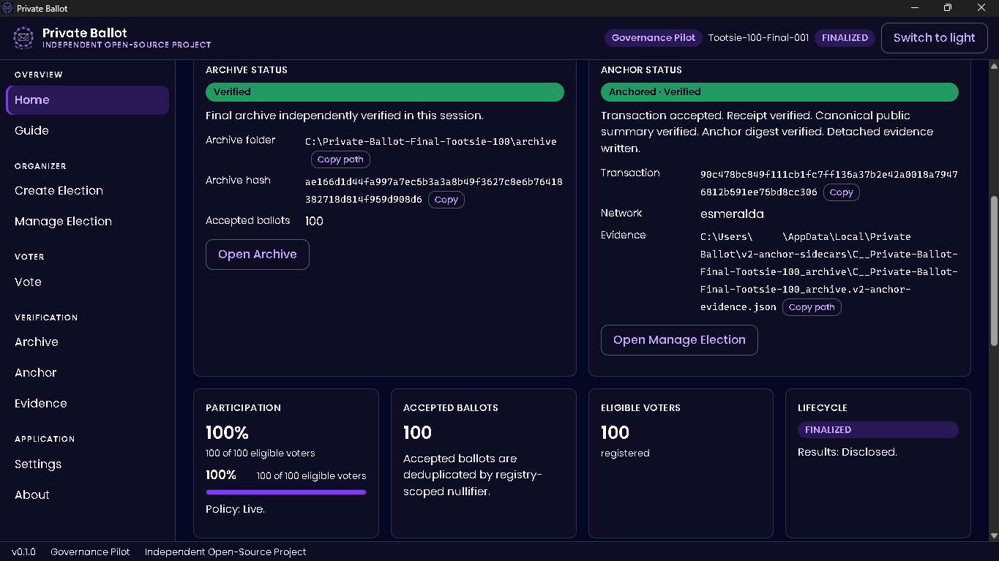
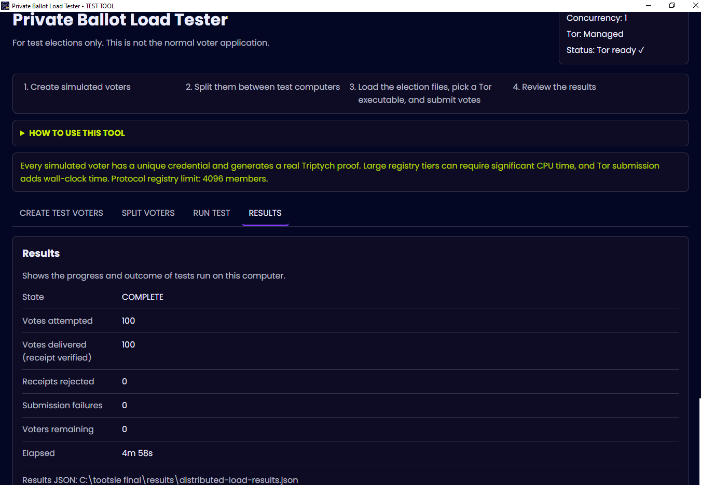
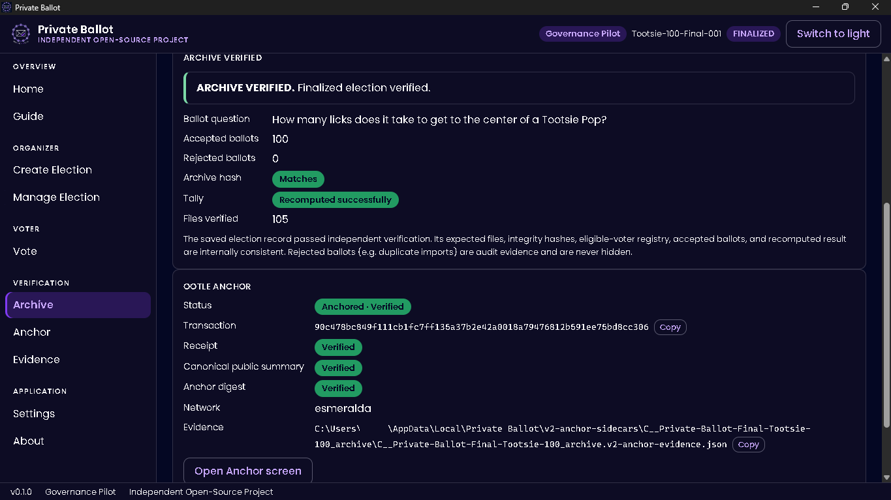
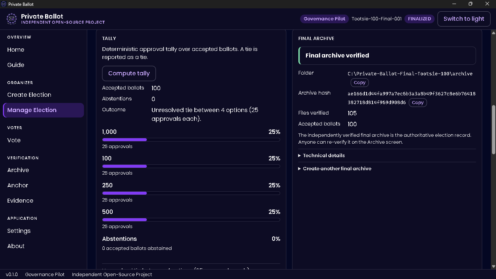
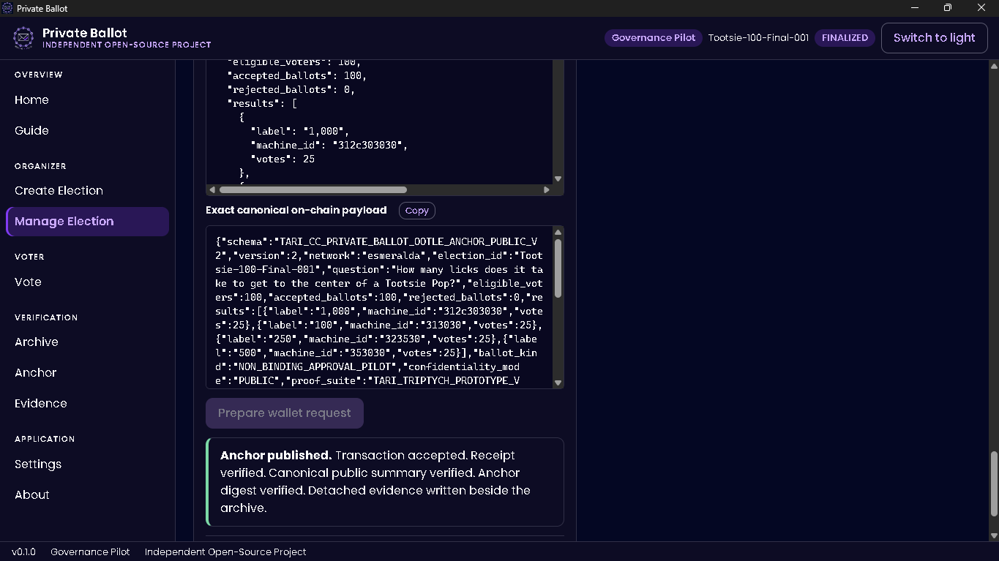

# Private Ballot

Private Ballot is privacy-preserving, verifiable voting software with
optional public anchoring on Tari Ootle. It is a desktop application and
protocol workspace for running non-binding governance pilot ballots. It is
offline-first: the finalized election archive is the authoritative
verification artifact, and an optional Tari Ootle anchor can commit public
aggregate evidence on Esmeralda testnet.

Status: **v0.1.0 Alpha, Governance Pilot, Esmeralda Testnet.** Private
Ballot is an **Independent Open-Source Project**. It is **not affiliated
with or endorsed by Tari Labs**, and it is not production election
software. Do not use it for binding governance, treasury, charter,
employment, or legal decisions.

License: **MIT OR Apache-2.0** (at the recipient's option). See
[LICENSE](LICENSE), [LICENSE-MIT](LICENSE-MIT), and
[LICENSE-APACHE](LICENSE-APACHE). Third-party components retain their own
licenses; see [THIRD_PARTY_NOTICES.md](THIRD_PARTY_NOTICES.md) and the
machine-readable reports under
[docs/release/licenses/](docs/release/licenses/).



*Final 100-voter release qualification: verified election, independently verified archive, and confirmed Tari Ootle V2 anchor.*

## Downloads and installation

Release binaries are attached to each GitHub Release. Pick the download that
matches your operating system **and** CPU architecture:

| Operating system | CPU | Download token | Notes |
| --- | --- | --- | --- |
| Windows 10/11 | 64-bit (Intel/AMD) | `windows-x86_64` | `.msi` (installer) or `-setup.exe` (NSIS) |
| Linux | 64-bit (Intel/AMD) | `linux-x86_64` | `.deb`, `.rpm`, or `.AppImage` |
| macOS — Apple Silicon | M1/M2/M3/M4 (or later) | `macos-aarch64` | `.dmg` |
| macOS — Intel | Intel Mac | `macos-x86_64` | `.dmg` |

The **Organizer** app is named `private-ballot-...`; the separate **Load
Tester** (a developer/test tool, not voter software) is named
`private-ballot-load-tester-...`. From v0.1.1 onward, release filenames follow a
single scheme — for example `private-ballot-v<VERSION>-windows-x86_64.msi` and
`private-ballot-v<VERSION>-macos-aarch64.dmg`. The full naming scheme and the
mapping from raw build outputs is documented in
[docs/release/RELEASE_ARTIFACT_NAMING.md](docs/release/RELEASE_ARTIFACT_NAMING.md).
(The published **v0.1.0** assets predate this scheme and keep their original
names.)

**Verify checksums before running any downloaded binary.** Each release
includes a `SHA256SUMS` manifest listing the exact filenames you download.
Compare the SHA-256 of your file against it:

```powershell
# Windows (PowerShell)
Get-FileHash .\private-ballot-v0.1.1-windows-x86_64.msi -Algorithm SHA256
```

```bash
# Linux / macOS
shasum -a 256 private-ballot-v0.1.1-macos-aarch64.dmg
```

### macOS: ad-hoc signed, unnotarized builds

The macOS `.dmg` builds are **ad-hoc signed and are NOT Apple Developer ID
signed or Apple-notarized.** macOS Gatekeeper may block the first launch or show
an "unidentified developer" warning. This is expected for ad-hoc-signed builds
and **does not** mean the app has been independently certified by Apple — so
verify the SHA-256 checksum above before you open it.

To open a build you trust after verifying its checksum (current macOS steps):

1. Double-click the app to try opening it normally.
2. If macOS blocks it, open **System Settings**.
3. Go to **Privacy & Security** and scroll down to the message about the
   blocked app.
4. Click **Open Anyway**.
5. In the confirmation prompt, click **Open**.

Do this only after you have verified the download's checksum. Do **not** disable
Gatekeeper system-wide to run the app.

## Privacy Model

The app separates three ideas that are easy to blur:

- Voter eligibility is proven with a Triptych-style membership proof.
- Ballot delivery privacy depends on the chosen submission route (managed
  Tor by default) and organizer logging discipline.
- Final verification depends on the complete offline archive, not on
  Ootle.

Individual votes are never published to Ootle. The V2 anchor path
publishes a public aggregate digest and scalar summary only, with detached
evidence that can be checked against the finalized archive. Voters do not
submit Ootle transactions; optional anchoring is organizer-side and
fee-bearing.

## Workflow

Organizers create and freeze an election, enroll voter public enrollment
keys, open intake, close voting, verify accepted ballots, finalize the
archive, and optionally anchor public aggregate evidence on Ootle.

Voters create an encrypted credential file, give the organizer only the
public enrollment key, load the issued election package, choose a route,
cast once, and keep their receipt and credential private.

## Governance source workflow (BLAKE3 pin)

An election is bound to a governance source document (the text that defines
what is being voted on). To pin it during **Create election → Governance
source**:

1. Select the source document.
2. Click **"Use this document digest as the pin"**. The app computes the
   document's BLAKE3 digest and binds it as the election's
   `governance_source_revision` pin.
3. **Do not modify the source document afterward.** Any change alters its
   BLAKE3 digest and will no longer match the pin.
4. **Keep the exact same source document.** When final archive verification
   requires it, you provide the same file so the verifier can confirm it
   still matches the bound pin.

The pin is a commitment, not a copy: the archive records the digest, and
verification re-hashes the document you supply and compares it to the pin.

## External requirements (not bundled)

Private Ballot is a self-contained desktop app for the parts of the
protocol it owns, but a real pilot needs one or two external runtimes that
the installer does **not** ship:

- **Tor** — required for private ballot intake (organizer) and private
  submission (voter). Install [Tor Browser](https://www.torproject.org/download/)
  or the [Tor Expert Bundle](https://www.torproject.org/download/tor/)
  and point the app at its `tor.exe`. The app validates the path and
  launches Tor as a child process; it never resolves `tor` from `PATH`
  and never downloads Tor for you.
- **Tari Ootle `walletd`** (v0.39.2 on Esmeralda) — required only if you
  want to publish an optional public anchor. Voters do not need walletd
  and do not need tTARI. The app talks to walletd on loopback at
  `http://127.0.0.1:5100/json_rpc`. No wallet API key is stored in this
  repository.

  After the wallet submits an Ootle anchor, receipt verification may remain
  in a **Polling** state for roughly a minute while walletd/the indexer
  observes the accepted transaction. **Do not resubmit the anchor** just
  because the receipt is still polling — wait briefly and use **Check
  receipt** again. Re-checking only re-polls the indexer; it never contacts
  walletd again.
- **tTARI** — Esmeralda testnet TARI, only for the organizer publishing
  an anchor, only enough to cover the transaction fee.

See [docs/OPERATOR_SETUP.md](docs/OPERATOR_SETUP.md) for a step-by-step
setup guide for organizers, voters, and developers.

## Tor transport modes

Ballots are submitted only over Tor onion services. The client reaches the
organizer onion through a SOCKS5 proxy in one of two explicit modes:

- **Managed Local Tor** — the default and recommended mode. Private Ballot
  starts, owns, and stops a local Tor process with a loopback SOCKS listener.
  Normal voters use this; there is no port, torrc, or data directory to set up.
- **Remote SOCKS proxy** — an advanced, opt-in mode for operators who already
  run Tor elsewhere. Private Ballot uses an **externally managed** SOCKS proxy
  (`host:port`) and does **not** start, stop, or verify that Tor daemon. Plain
  SOCKS is unencrypted between the app and the proxy, so this mode is intended
  only for a **trusted LAN, VPN, or tunnelled (e.g. SSH-forwarded) endpoint** —
  never an arbitrary Internet-exposed proxy. There is **no clearnet fallback**
  and `.onion` is still resolved only inside Tor; a proxy or onion failure fails
  closed. Remote SOCKS is voter/client **outbound** transport only — the
  organizer intake onion service still requires a locally managed Tor.

See [docs/SECURITY_MODEL.md](docs/SECURITY_MODEL.md) §8 for the full trust
boundary of each mode.

## Repository Layout

- `crates/` - Rust protocol, archive, verifier, transport, GUI-core,
  Ootle adapter, and controlled-alpha tooling crates.
- `gui/` - Tauri 2 desktop shell and React frontend.
- `templates/` - Tari Ootle template source. Compiled WASM belongs in
  release assets, not ordinary source.
- `docs/` - architecture, runbooks, threat model notes, decisions, and
  release audit records.
- `test-vectors/` - public canonical valid/invalid vectors.
- `tools/`, `scripts/`, `fuzz/` - developer/auditor tooling.
- `third_party/tari-triptych/` - vendored Triptych implementation,
  licensed under BSD-3-Clause.

## Private Ballot Load Tester — TEST / DEVELOPER TOOL

The `tools/distributed-load-tester-gui/` app is the **Private Ballot Load
Tester — a TEST / DEVELOPER tool. It is NOT normal voter software** and must
never be used to cast real ballots. It exists to drive synthetic voters at
scale over managed Tor for developers and auditors.

Its synthetic option choices are **deterministic and reproducible**
(round-robin: voter *i* picks option `i % option_count`). This means:

- If the voter count is **evenly divisible** by the option count, the
  synthetic tally is an **intentional exact tie**. For four options,
  100 voters → **25 / 25 / 25 / 25**.
- For exactly one option to lead, choose a voter count where
  `voter_count % option_count == 1`. For four options,
  101 voters → **26 / 25 / 25 / 25**.

## Build And Test

Frontend checks:

```powershell
cd gui
npx tsc --noEmit
npm test
```

Focused V2 anchor lifecycle checks:

```powershell
cargo +1.97.1-x86_64-pc-windows-msvc test -p tari-cc-private-ballot-gui-core --test live_anchor_v2 --test live_anchor_v2_lifecycle
```

Windows package build (developer only — MSVC BuildTools + vcpkg required):

```powershell
cd gui
$env:RUSTUP_TOOLCHAIN = '1.97.1-x86_64-pc-windows-msvc'
$env:VCPKG_ROOT = 'C:\path\to\vcpkg'          # your local vcpkg checkout
$env:VCPKG_DEFAULT_TRIPLET = 'x64-windows-static-md'
$env:VCPKGRS_TRIPLET = 'x64-windows-static-md'
$env:VCPKG_VISUAL_STUDIO_PATH = 'C:\Program Files (x86)\Microsoft Visual Studio\2022\BuildTools'
$env:OPENSSL_DIR = "$($env:VCPKG_ROOT)\installed\x64-windows-static-md"
npm run tauri build
```

The generated `.exe`, `.msi`, `.wasm`, and checksum files are release
assets. They should be attached to a GitHub Release only after provenance
and checksums are recorded.

## Qualification and platform status

Qualification numbers below reflect the v0.1.0 release pass.

**Windows 11 x64 — physically end-to-end qualified.** A final fresh physical
election ran completely: 100 eligible voters, 100 selected, 100 submission
attempts, 100 successful deliveries, 100 verified receipts, 0 submission
failures, 0 rejected receipts; the organizer accepted 100 and rejected 0; the
tally was computed, the election finalized, the canonical archive written and
**independently verified**, and a Tari Ootle V2 anchor was prepared, accepted
by the wallet, receipt-verified, and **published on-chain**. An earlier
finalized 100-voter election whose archive failed after a GUI restart was
recovered and archived with the durable transport-binding recovery path. The
full test matrix passed on Windows (Rust toolchain
`1.97.1-x86_64-pc-windows-msvc`):

- Organizer frontend: 871 passed / 0 failed
- Organizer root workspace (Rust): 1849 passed / 0 failed / 14 ignored
- Organizer `gui/src-tauri`: 86 passed / 0 failed
- Load Tester frontend: 24 passed / 0 failed
- Load Tester `src-tauri`: 20 passed / 0 failed



*Final 100-voter release qualification driven by the standalone Load Tester over the real managed-Tor transport and Tari Triptych proof path, using distinct simulated voter credentials — 100 delivered, zero submission failures, zero organizer rejections.*

An earlier historical distributed test across multiple physical hosts requested
500 ballots with 499 accepted, 0 rejected, and 1 recorded pre-submission
private-transport failure (do not read this as 500/500); startup readiness,
count integrity, and safe pre-send onion recovery were subsequently hardened
and independently reviewed.

**Linux (Ubuntu 22.04.5 LTS x64) — built, tested, and packaged.** In this
release pass, from a fresh clone of the release source (Node v24.20.0, npm
11.19.0, Rust 1.97.1):

- Organizer frontend: 871 passed / 0 failed; type-check and production build
  (`vite build`) passed.
- Load Tester frontend: 24 passed / 0 failed; type-check and build passed.
- Root Rust workspace: `cargo check --workspace --all-targets` exit 0;
  `cargo test --workspace` was 1838 passed / 8 failed / 14 ignored.

**All 8 Rust failures were individually verified as Linux test-fixture/platform
portability issues, not protocol or security regressions** — 6 are cases where
the Unix `tor` binary validator correctly requires the executable bit but the
(Windows-authored) test fixtures create a fake `tor` file without `chmod +x`,
and 2 assert Windows-style path suffixes / `/tmp` canonicalization. The Node
test runner now executes on Node 24 (the earlier Node-20 `--experimental-strip-types`
limitation no longer applies).

The Tauri desktop shell was built for both applications with the GTK/WebKit
development packages (`libwebkit2gtk-4.1-dev`, `libgtk-3-dev`, `librsvg2-dev`,
`libayatana-appindicator3-dev`) present. Each application produced Linux desktop
bundles in `.deb`, `.rpm`, and `.AppImage` formats (six Linux artifacts total).
See [docs/OPERATOR_SETUP.md](docs/OPERATOR_SETUP.md) for the Linux dependency
list needed to build the desktop shell.

These are successful Linux builds and automated test runs (under WSL); Windows
11 x64 remains the fully qualified physical end-user runtime path (the physical
end-to-end election above).

**macOS — hosted GitHub Actions qualification passed (both architectures).**
The macOS qualification workflow
([.github/workflows/macos-qualification.yml](.github/workflows/macos-qualification.yml))
completed successfully on GitHub-hosted runners for both Apple Silicon /
aarch64 (`macos-15`) and Intel / x86_64 (`macos-15-intel`). Both the Organizer
and the standalone Load Tester built and packaged successfully, producing four
macOS `.dmg` artifacts (see the per-architecture `SHA256SUMS` manifests). The
macOS DMGs are **ad-hoc signed and unnotarized** — they are not Apple Developer
ID signed and not Apple-notarized, so users may need to approve the app through
macOS **Privacy & Security** on first launch (see
[Downloads and installation](#downloads-and-installation) for the exact steps).
No physical macOS election was performed; Windows 11 x64 remains the primary
physical end-to-end qualification target.

## Verification

The archive verifier and GUI evidence screens are intended to let an
auditor replay the finalized archive, recompute the tally, inspect legacy
V1 anchor evidence, and verify V2 public-summary evidence. Historical V1
verification compatibility remains intentionally supported; V1 publishing
UX is not part of the normal alpha workflow.



*Independent verification: ARCHIVE VERIFIED with the tally recomputed and every archive file verified, and the Tari Ootle V2 anchor Anchored · Verified via receipt, summary, and digest checks.*



*Deterministic 25/25/25/25 qualification tally over 100 accepted ballots, with the finalized canonical archive produced and independently verified.*

See [docs/INDEPENDENT_VECTOR_VERIFIER.md](docs/INDEPENDENT_VECTOR_VERIFIER.md),
[docs/CONTROLLED_ALPHA_RUNBOOK.md](docs/CONTROLLED_ALPHA_RUNBOOK.md), and
[templates/ootle-anchor-event-template-v2/DEPLOYMENT_RUNBOOK.md](templates/ootle-anchor-event-template-v2/DEPLOYMENT_RUNBOOK.md).

The optional Tari Ootle V2 anchor commits a canonical public aggregate payload —
a public aggregate digest and scalar summary only, never individual votes:



*The canonical public aggregate payload committed by the optional Tari Ootle V2 anchor.*

> **Note on frozen identifiers.** Some V2 protocol/schema identifiers retain the
> historical `TARI_CC_PRIVATE_BALLOT` prefix (for example,
> `TARI_CC_PRIVATE_BALLOT_OOTLE_ANCHOR_PUBLIC_V2`). They are frozen compatibility
> identifiers, not current product branding, and are intentionally preserved for
> protocol interoperability.

## Security

Read [SECURITY.md](SECURITY.md) before operating a pilot. The current
threat-model material lives mainly under [docs/transport/](docs/transport/);
it documents organizer trust boundaries, transport assumptions, logging
limits, archive authority, and alpha limitations.

Never commit live election archives, voter credentials, wallet databases,
wallet API keys, LocalAppData runtime state, Tor service keys, transport
authority private keys, or Ootle evidence sidecars from a real run.

## Contributing

See [CONTRIBUTING.md](CONTRIBUTING.md). Contributions are dual-licensed
under `MIT OR Apache-2.0` unless you explicitly state otherwise; there is
no CLA and no DCO sign-off requirement.
